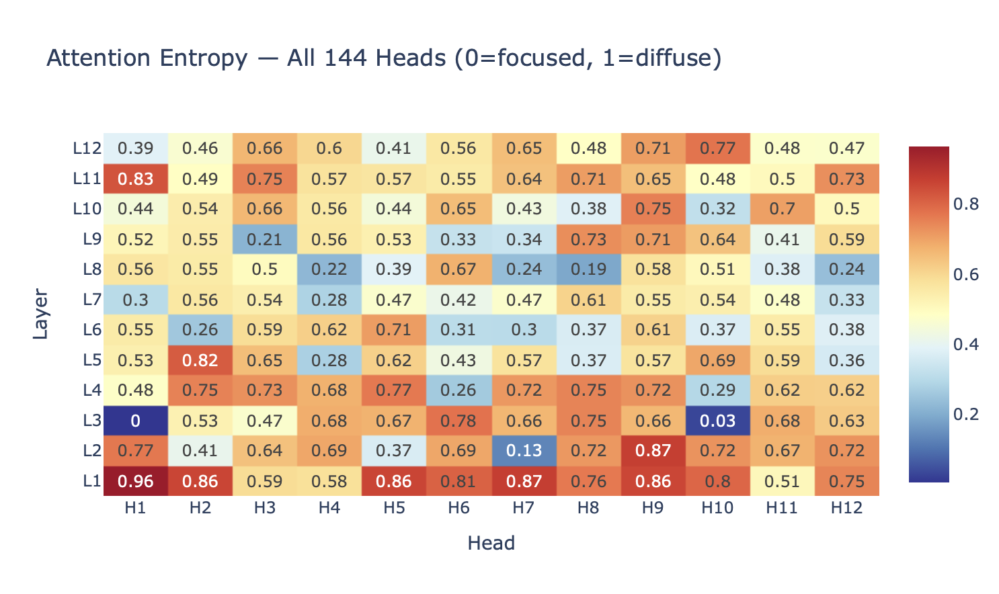
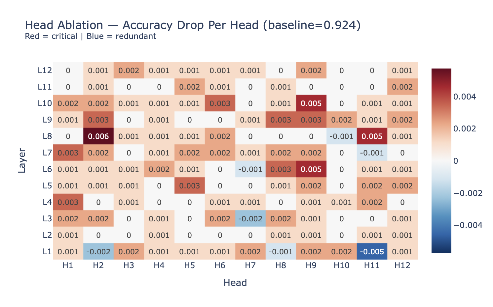
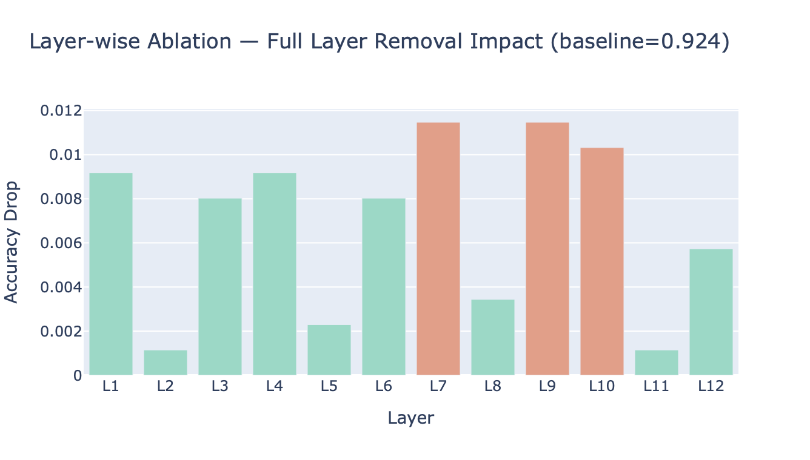
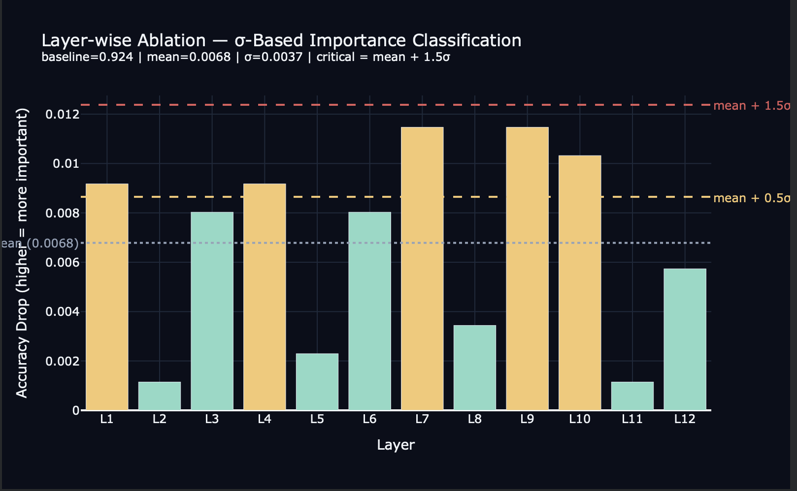
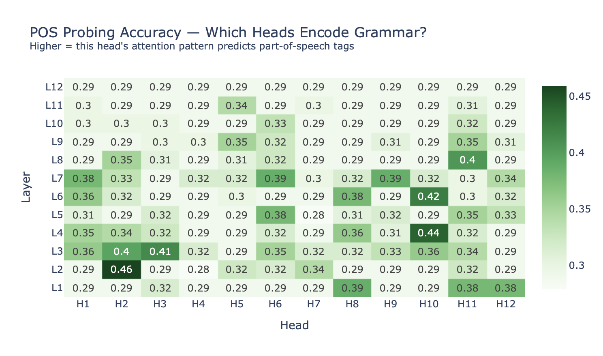

# BERT Attention Visualizer

**[Open in Google Colab →](https://colab.research.google.com/drive/18tvGufThwBYtrGp0lhurQtjIRgapP7si?usp=sharing#scrollTo=gomk7INFlOAu)**

I built this project to understand what's happening inside BERT, not just use it as a black box. I wanted to see what all **144 attention heads** are actually doing on real sentences, beyond the usual matrix-and-softmax explanation.

It reproduces findings from four published NLP papers in a Jupyter notebook. There's also a small FastAPI backend + Flutter app if you want to poke at results interactively. 

## Demo

https://github.com/khanak0509/Attention-Visualizer/raw/main/demo/Attention.mp4

<video src="https://github.com/khanak0509/Attention-Visualizer/raw/main/demo/Attention.mp4" controls width="100%"></video>

If the player is blank, [download or open the demo video here](demo/Attention.mp4).

---

## What I Built

Six modules. Each one answers one question I actually cared about:

| Module | Question |
|--------|------------|
| **Attention Extraction** | How do I get raw attention weights out of BERT? |
| **Heatmap Viewer** | What does one head's attention look like on my sentence? |
| **Head Taxonomy** | What are all 144 heads doing, broadly? |
| **Attention Rollout** | What is BERT *really* attending to after all layers? |
| **Head Ablation** | Which heads matter for SST-2 sentiment? |
| **Probing Classifiers** | Did BERT accidentally learn grammar in its attention? |

---

## Papers I Reproduced

### Clark et al. 2019: *What Does BERT Look At?*
*Stanford NLP Group*

This was one of the first papers to systematically look at BERT attention instead of just using it. They visualized heads across layers and noticed most fall into recognizable patterns: some always stare at `[CLS]`, some track neighbors, some look syntactic.

**What I did:** I built a simple head classifier using entropy, vertical score (attention to `[CLS]`/`[SEP]`), and diagonal score (adjacent tokens). It labels every head as **vertical, focused, broad, or positional**. On my sentences, the majority really are "sink" heads routing to special tokens. Same story Clark told, but I see it on my own inputs.

---

### Michel et al. 2019: *Are Sixteen Heads Really Better than One?*
*Carnegie Mellon University*

They asked: what if you delete heads? On translation and BERT tasks, **most heads barely matter**. You can remove a huge fraction with little accuracy loss.

**What I did:** I ablated heads one at a time on **SST-2** using a fine-tuned BERT (`textattack/bert-base-uncased-SST-2`). PyTorch forward hooks zero out one head's 64-dim slice, I run the full validation set, measure accuracy drop, restore the head. All **144 heads** individually, then **12 layer-wise runs** where I remove every head in a layer at once. The layer-wise part gives a much stronger signal than any single head.

---

### Abnar & Zuidema 2020: *Quantifying Attention Flow in Transformers*
*University of Amsterdam*

Raw attention at layer 8 is misleading. By then, "cat" isn't just "cat"; it's already mixed with everything from layers 1–7. So a heatmap at one layer doesn't tell you how input tokens influenced the output.

**Attention rollout** fixes this: multiply attention matrices layer by layer, add residual connections, renormalize. You get an estimate of **information flow** from original tokens forward.

**What I did:** Full rollout over 12 layers. Comparing raw last-layer `[CLS]` attention vs rollout on the same sentence, they disagree a lot. Rollout points at content words; raw attention often just highlights `[SEP]`. That's exactly the trap Abnar warned about.

---

### Tenney et al. 2019: *BERT Rediscovers the Classical NLP Pipeline*
*Google Research*

Classic NLP goes POS → syntax → semantics in stages. BERT was never told that pipeline, only masked word prediction. Tenney showed BERT **recreates it anyway**, with lower layers doing syntax-ish work and higher layers doing harder semantic stuff. They used **probing classifiers**, tiny linear models on internal reps to predict linguistic labels.

**What I did:** Logistic regression probes on **attention row vectors** (not hidden states) across all 144 heads to predict POS tags (spaCy labels, aligned to BERT subwords). Best heads sit in early layers; syntax signal shows up where Tenney said it would.

---

## My Findings

### Head taxonomy: what are 144 heads doing?

On my test sentences, the split looked roughly like this:



```
Vertical     ~96 heads  (67%)  : mostly attend to [CLS] or [SEP]
Focused      ~23 heads  (16%)  : sharp, specific patterns
Broad        ~17 heads  (12%)  : high entropy, spread everywhere
Positional   ~8 heads   (6%)   : diagonal / neighbor tracking
```

Two thirds of the model is basically plumbing, moving info toward special tokens. The interesting behavior lives in the focused minority.

**Most focused head I saw:** Layer 3, Head 1, entropy ~0.005, diagonal score ~0.909. It puts most of its weight on the token right next door. A positional conveyor belt.

**Most diffuse:** Layer 1, Head 1, entropy ~0.964. Almost uniform attention. No clear preference.

Reading about sink heads in a paper is one thing. Seeing **96 out of 144** behave that way on your own sentence is another.

---

### Attention rollout: what does BERT actually read?

**Sentence:** *"The cat sat on the mat near the window."*

![Raw last-layer attention vs attention rollout for [CLS]](output_image/raw_vs_rollout.png)

Raw last-layer attention: `[CLS]` loves `[SEP]`. Not very helpful for understanding sentiment.

Rollout: `[CLS]`'s influence comes from **content words** (cat, sat, mat, window) more than function words (the, on, near). That matches what you'd want a classifier to care about.

Same sentence, two methods, different stories. I wouldn't trust single-layer heatmaps alone after seeing this.

---

### Head ablation: which heads matter?

**Setup:** `textattack/bert-base-uncased-SST-2`, SST-2 validation (**872 examples**), baseline **92.43%**.

#### Single-head ablation



```
Most important single head : Layer 8, Head 2  (drop 0.57%)
Mean drop across all heads : 0.11%
Heads with negative drop   : 20+  (removing them helps a bit)
```

If you use a hard **1% absolute threshold**, you get **0/144 critical**. That sounds like "nothing matters", but BERT on SST-2 is over-parameterized; drops are tiny in absolute terms.

Relative to the distribution:

```
Layer 8 Head 2 drop  = 0.0057
Mean drop            = 0.0011
Std dev              = 0.0014
                     ≈ +3.3σ above mean
```

So L8/H2 is small in absolute terms but **stands out** compared to every other head. That's the honest way to read Michel-style ablation on this task.

Negative drops are weird and interesting: some heads slightly **hurt** SST-2 accuracy. Pretraining baggage that doesn't help sentiment.

#### Layer-wise ablation (all 12 heads in a layer removed at once)

This is the stronger experiment. One head at a time barely moves accuracy; removing a whole layer does:





σ thresholds computed from the 12 layer drops (mean = 0.0068, σ = 0.0037):

```
Critical  (drop > mean + 1.5σ = 0.0124):  none
Notable   (drop > mean + 0.5σ = 0.0086):  L1, L4, L7, L9, L10
Redundant (below notable threshold):      L2, L3, L5, L6, L8, L11, L12
```

Ranked by drop:

```
  #1  L7   0.0115  +1.26σ  notable   (below critical line)
  #2  L9   0.0115  +1.26σ  notable
  #3  L10  0.0103  +0.95σ  notable
  #4  L1   0.0092  +0.64σ  notable
  #5  L4   0.0092  +0.64σ  notable
  #6  L3   0.0080  +0.33σ  redundant
  #7  L6   0.0080  +0.33σ  redundant
  #8  L12  0.0057  -0.28σ  redundant
  #9  L8   0.0034  -0.90σ  redundant
 #10  L5   0.0023  -1.20σ  redundant
 #11  L2   0.0011  -1.51σ  redundant
 #12  L11  0.0011  -1.51σ  redundant
```

L7 and L9 have the largest raw drops, but even they stay **below** the critical threshold (red line at mean + 1.5σ). That is the right read: full-layer removal hurts, yet no single layer crosses "critical" by this metric.

The thing that stuck with me: **Layer 8 sits between Layers 7 and 9 (the two biggest drops), but Layer 8 itself is weak (+1.26σ vs -0.90σ).** Feels like redundant parallel paths. Neighbors cover similar work; the middle layer matters less.

Also counterintuitive: **notable layers include early L1 and L4, while late layers L2 and L11 barely move accuracy when removed.** I assumed "last layers do classification." Not what I measured here.

---

### Probing: did BERT learn grammar?

**Setup:** Logistic regression on attention rows → POS tag (13 classes, spaCy). ~111 tokens from 10 reference sentences + whatever you analyze.



```
Random baseline (1/13)     :  7.7%
Best head (Layer 2, H 2) : ~46–49%  (varies slightly by run)
Roughly 6× above random
```

A linear classifier on **one head's attention pattern** predicts noun vs verb vs adjective better than chance. BERT wasn't trained on grammar. It picked this up predicting masked words on billions of tokens.

Layer curve peaks early (layers 2–3), fades later, same shape Tenney reported. Syntax in the bottom; semantics upstairs.

**Caveat I keep reminding myself:** 46% ≠ "this head detects nouns." It means attention patterns **correlate** with POS. The head learned some behavior that lines up with grammar, not an explicit tagger.

---

## How It Works (implementation notes)

**Two models, on purpose:**

| Model | Used for |
|-------|----------|
| `bert-base-uncased` | Attention, taxonomy, rollout, probing |
| `textattack/bert-base-uncased-SST-2` | Ablation only (needs classification accuracy) |

Ablation on the base model would be meaningless; no label to measure.

**Ablation:** `register_forward_hook` on `attention.self`, zero head slice `[head_idx*64 : (head_idx+1)*64]`, run SST-2 batch, `handle.remove()`. No retraining. No permanent weight edits.

**Probing alignment:** WordPieces (`running` → `run`, `##ning`) get the parent word's POS from spaCy. Rows are padded to max length across sentences before sklearn sees them.

**Repo layout (brief):**

```
Visualizer.ipynb              ← main notebook, run this
llm_attention_visualizer.ipynb
demo/Attention.mp4            ← Flutter app walkthrough video (2 MB)
output_image/                 ← README figures
backend/                      ← optional API for the Flutter viewer
visualizer/                   ← optional UI (least important part)
scripts/clean_notebook_for_github.py
```

---

## Setup

```bash
git clone https://github.com/khanak0509/Attention-Visualizer
cd Attention-Visualizer

pip install torch transformers plotly matplotlib numpy pandas \
            scikit-learn spacy datasets fastapi uvicorn

python -m spacy download en_core_web_sm
jupyter notebook Visualizer.ipynb
```

Run cells top to bottom. **Single-head ablation on 872 examples takes ~5–15 minutes on CPU** (144 passes over the val set, plus 12 layer-wise passes). GPU/Colab is faster.

Optional, if you want the interactive viewer:

```bash
# terminal 1
cd backend && uvicorn server:app --reload --port 8000

# terminal 2
cd visualizer && flutter run
```


---

## References

```
Clark, K., Khandelwal, U., Levy, O., & Manning, C. D. (2019).
What Does BERT Look At? An Analysis of BERT's Attention.
BlackboxNLP Workshop, ACL 2019.

Michel, P., Levy, O., & Neubig, G. (2019).
Are Sixteen Heads Really Better than One?
NeurIPS 2019.

Abnar, S., & Zuidema, W. (2020).
Quantifying Attention Flow in Transformers.
ACL 2020.

Tenney, I., Das, D., & Pavlick, E. (2019).
BERT Rediscovers the Classical NLP Pipeline.
ACL 2019.
```

---
